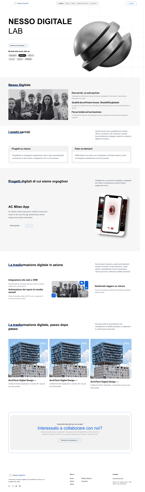
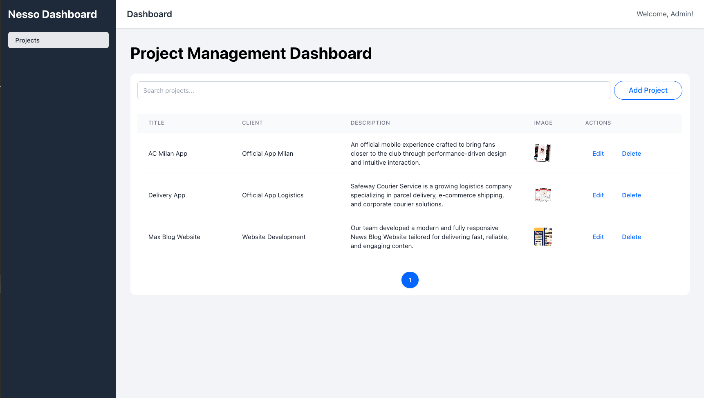

# Senior Front-End Engineer Take-Home Project

## Overview

This repository contains the implementation for a take-home project designed to showcase skills in building a responsive landing page with Next.js, a reusable component set, and a small "app-like" feature with React (Vite). The project is structured as a monorepo to maximize code sharing and maintainability.

## Monorepo Structure

apps/
next-landing-page
vite-dashboard
packages/
shared-ui
shared-config
shared-tailwind

## What Was Built & Project Navigation

The project is divided into three main packages within this monorepo:

1.  **Landing Page (`apps/next-landing-page`)**

    - A responsive marketing website built with Next.js and the App Router.
    - Implements several standard sections: Hero, Services, Features, Projects, CTA, and a Footer.

2.  **Dashboard App (`apps/vite-dashboard`)**

    - A small, self-contained single-page application built with React and Vite.
    - Its core feature is displaying project data in a `ProjectTable` and allowing users to add/edit data via a `ProjectForm`.
    - Demonstrates state management, component decomposition, and handling user interactions.

3.  **Shared Packages (`packages/*`)**

Reusable packages shared across both applications:

    - **shared-ui**  
      Reusable UI components such as `Button`, `Card`, `Input`, `Table`, and `Typography`.

    - **shared-tailwind**  
      Centralized Tailwind tokens and CSS variables to ensure consistent design across Next.js and Vite apps.

    - **shared-config**  
      Shared configuration and constants (e.g., API endpoints, environment config, TypeScript base config).

## Tech Stack

- Next.js 14 (App Router)
- React 18
- Vite
- Tailwind CSS v4 & v3
- TypeScript
- React Testing Library + Vitest
- NPM Workspaces

## Setup & Running the Project

**Prerequisites:**

- Node.js v20.x or higher

**Steps:**

1.  **Clone the repository:**

    ```bash
    git clone https://github.com/bayunugrohoDev/nesso-digitale
    cd nesso-digitale
    ```

2.  **Install dependencies:**
    This project uses NPM workspaces. Install all dependencies from the root directory.

    ```bash
    npm install
    ```

3.  **Run the applications:**

    - **To run the Landing Page (Next.js):**

      ```bash
      npm run dev:next
      ```

      Open [http://localhost:3000](http://localhost:3000) in your browser.

    - **To run the Dashboard App (Vite):**

      ```bash
      npm run dev:vite
      ```

      Open [http://localhost:5173](http://localhost:5173) (or the port shown in your terminal).

    - **To run Unit Tests (Vite):**
      ```bash
      npm run test
      ```
    - **To run Both Landing page and Dasboard app:**
      ```bash
      npm run dev
      ```

## Technical Decisions & Trade-offs

- **Monorepo Architecture:**
  I chose a monorepo structure using NPM Workspaces to cleanly separate the applications (`next-landing-page`, `vite-dashboard`) while enabling efficient code sharing. This is most evident with the `shared-ui` and `shared-tailwind` packages, ensuring visual and functional consistency across the project.

- **Styling:**
  Styling & Tailwind v4: I utilized Tailwind CSS v4 for the landing page to leverage its "CSS-first" engine. To bridge the gap between v4 (Next.js) and v3 (Vite), I centralized design tokens using CSS Variables in packages/shared-tailwind. This ensures a "pixel-tight" implementation from Figma while managing the different configuration systems of each framework..

- **State Management (Vite App):**
  For the dashboard, I relied on React's built-in state management and URL search parameters for filtering logic. By avoiding external libraries like Redux or Zustand, I kept the bundle size minimal and ensured that the application state (like search results) is easily shareable and bookmarkable via the URL—a key requirement for admin-style dashboards.

## Testing Strategy

- Unit tests for dashboard core flows (CRUD)
- Shared UI components tested in isolation
- Future plan: Playwright E2E for critical flows

## Future Improvements

If I had more time, I would focus on the following:

- Real-time Data Integration: Connecting the Dashboard and Landing Page through a shared API, so any project updates in the Dashboard reflect automatically on the Landing Page.
- Scroll Animations: Adding reveal effects on scroll using Framer Motion to give the Landing Page a more premium and interactive feel.
- Lazy Load Loading: Implementing lazy loading for section components to improve the user experience and reduce the initial bundle size.
- Dashboard Optimizations: Improving mobile responsiveness for the dashboard and adding features like drag-and-drop for reordering projects.
- Expanded Testing: Increasing code coverage with more unit tests and adding E2E testing with Playwright to ensure critical user flows are rock-solid.

## Screenshots



